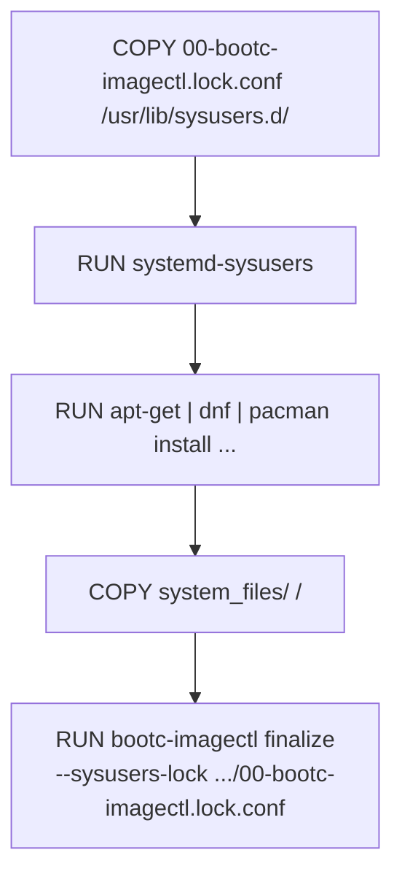

# Users and groups

This document describes how `bootc-imagectl finalize` handles the users and
groups created during a bootc image build.

## Terminology

| Term | Meaning | Source |
| ---- | ------- | ------ |
| User, group | An entry in `/etc/passwd` or `/etc/group`, identified by a UID or GID. | passwd(5), group(5) |
| System user, system group | A user or group whose UID or GID lies in the range `SYS_UID_MIN`–`SYS_UID_MAX` or `SYS_GID_MIN`–`SYS_GID_MAX`. | login.defs(5) |
| Regular user, regular group | A user or group whose UID or GID lies in the range `UID_MIN`–`UID_MAX` or `GID_MIN`–`GID_MAX`. | login.defs(5) |
| System account | A user created in the system range with `useradd --system`. | useradd(8) |
| NSS | The Name Service Switch, glibc's mechanism for looking up users and groups from the sources listed in `/etc/nsswitch.conf`. nss-systemd is the source that resolves lookups from systemd's user database. | nsswitch.conf(5), nss-systemd(8) |
| User record | The JSON description of a user defined by systemd. | [User Record](https://systemd.io/USER_RECORD/) |
| Group record | The JSON description of a group defined by systemd. | [Group Record](https://systemd.io/GROUP_RECORD/) |
| Drop-in directory | A directory such as `/usr/lib/userdb` from which systemd-userdbd reads user and group records. | systemd-userdbd(8) |
| Membership file | A file `<user>:<group>.membership` in a drop-in directory that makes a user a member of a group. | nss-systemd(8) |
| Privileged user record | A file `<name>.user-privileged` next to a user record, readable only by root, that holds the fields of the record only root may see, such as the password hash. | systemd-userdbd(8) |

## Overview

On all major Linux distributions, a package that creates users or groups when it
is installed takes whichever UID or GID is free at installation time. In a container
build the UID or GID a package receives depends on which packages were installed
earlier. These UIDs and GIDs are then fixed for the life of the installed
system, because `/etc` is typically persistent on bootc. The `/etc/passwd` and
`/etc/group` from the image are copied once when the system is installed, and a
bootc upgrade does not update them.

This creates the following problems:

- UID/GID drift: A rebuild with a different package set allocates different UIDs
  and GIDs to the packages that were already installed.
- A package removed from the image takes its files with it, but its user
  stays in the system's `/etc`.

`bootc-imagectl finalize` addresses these problems as follows:

- Every user and group is created with a fixed UID and GID from a sysusers
  lock file in the image, before any package is installed. The build fails if
  a package creates a user or group not present in sysusers.d.
- Users and groups are stored as user and group records under
  `/usr/lib/userdb`, with a membership file for each group a user belongs
  to. `/usr` is tracked in the bootc image, so the records on a system
  follow the image on upgrade.
- `/etc/passwd`, `/etc/shadow`, `/etc/group` and `/etc/gshadow` keep only
  `root` and `nobody`. The booted system creates no accounts: every account
  comes from the image.
- The accounts of a removed package stay in the image, locked, so that no
  later account takes their IDs.

## Goals

- A UID or GID published in an image never changes in later builds, whatever
  packages are added, removed or reordered.
- A UID or GID is never given to another account once its account is
  removed, and a removed user cannot log in.
- An account dropped from an image is gone from the system after an upgrade.
- The image author does not need to manually select UIDs or GIDs. On the
  first build, `bootc-imagectl finalize` reports the lines the sysusers lock
  file must contain.
- The proposed mechanism must work on all systemd-based linux distributions.
- The proposed mechanism must work with sealed bootc images.

## Background

On a bootc system `/usr` is tracked in the image. `/etc` is typically
persistent: on upgrade bootc performs a
[three-way merge](https://bootc.dev/bootc/filesystem.html#etc) of the new
image's `/etc` with the system's. A file modified on the system is kept over
the image's version. `/etc/passwd` and `/etc/group` are modified on almost
every installed system. This means that changes to the image's `/etc/passwd`
and `/etc/group` are not propagated to the live system.

When a package is installed on a systemd-based Linux distribution such as
Fedora, Debian or Arch Linux, it creates the users and groups it needs with
`useradd -r`, `adduser --system` or `systemd-sysusers`. All three tools
allocate a free UID or GID in the system range of login.defs(5), so the
UID/GID a user configured in a package receives depends on the packages
installed before it. All three also accept a user or group that already
exists. In this case they leave its UID and GID unchanged.
`bootc-imagectl finalize` uses this property to define every UID and GID
before any package is installed.

## Design

### Requirements

- A bootc system.
- systemd with nss-systemd, and `systemd` in `/etc/nsswitch.conf`.
- `systemd-sysusers` in the build and enabled at boot.
- dracut, to include `/usr/lib/userdb` in the initramfs.

### Sysusers lock file

The image contains a sysusers.d file that lists every user and group created
in the build, including their fixed UID and GID:

```text
/usr/lib/sysusers.d/00-bootc-imagectl.lock.conf
```

It uses ordinary sysusers.d(5) syntax:

```text
# package: avahi-daemon
g avahi 900
u avahi 900 "Avahi mDNS/DNS-SD daemon" / /usr/bin/nologin
# package: systemd
g systemd-journal 981
u systemd-network 976 "systemd Network Management" / /usr/bin/nologin
m daemon adm
```

The file is a sequence of blocks. A `# package: <name>` comment starts a
block and names the package that created the accounts on the lines that
follow. `# package: -` marks accounts that no package created and that are
kept on purpose. `finalize` determines the package from the sysusers.d file
that specifies the account, which the package manager attributes to its
owner. Debian has not fully adopted sysusers.d, and accounts are typically
created in a maintainer script with `adduser --system`. For these accounts
`finalize` prints the block with the package name blank and the author must
fill it in.

When a package is removed, it becomes a `# removed: <name>` block:

```text
# removed: geoclue-2.0
u geoclue 107 - /var/lib/geoclue /usr/sbin/nologin
```

The image keeps creating the accounts, with their IDs, so no other account
can take them. `finalize` locks their user records.

Accounts are kept because an upgrade does not remove state left behind
by a removed account, e.g. under persistant `/var`. If a package returns,
the stale entry check requires changing the header back to `# package: <name>`.

This file is an image's sysusers lock file. `bootc-imagectl finalize` takes
its path with `--sysusers-lock`, prints its contents at the end of the build,
and the author commits it next to the Containerfile. The `00-` prefix makes it
take precedence over any package's sysusers.d file.

### Build steps



1. The sysusers lock file is copied in first, and `systemd-sysusers` creates
   every user and group it specifies.
2. The specified packages are installed. A package whose user or group is in
   the sysusers lock file finds it already created and keeps its UID and GID.
   A package whose user or group is not in the sysusers lock file allocates a
   free UID or GID.
3. `finalize` writes the user and group records and membership files. If a package
   allocated a user or group the sysusers lock file does not specify, the
   build fails and prints the lines to add. The author appends them and
   rebuilds. On the first build the file does not exist yet and every line
   is printed.

A UID or GID is chosen once, by the package that first creates the account.
From then on the sysusers lock file keeps it fixed.

All packages, including tools only the build needs such as `systemd-ukify`,
must be installed before `finalize`. Package managers such as dpkg and rpm
read users from `/etc/passwd` instead of through NSS, so they no longer
find the users `finalize` moved.

### Derived images

Building an image `FROM` an image that `finalize` already processed is a goal,
but is not supported yet. The following problems need to be solved:

- The parent's users and groups are records in `/usr/lib/userdb`, not
  entries in `/etc/passwd` and `/etc/group`. rpm reads these files directly,
  so it installs a file the package assigns to one of the parent's accounts
  as owned by root instead.
- dpkg installs such a file with the right owner, but `finalize`'s ownership
  [check](#checks) fails, because it only looks up the file's owner in
  `/etc/passwd` and `/etc/group`.
- The derived build needs a sysusers lock file of its own, which must not
  reuse an ID of the parent's, and `finalize` must report missing lines only
  for that file.

### Finalize

`bootc-imagectl finalize` handles users and groups before it builds the initramfs.
It performs the following steps:

1. Reads `/etc/passwd`, `/etc/shadow`, `/etc/group` and `/etc/gshadow`, and
   every sysusers.d configuration file in the directories `systemd-sysusers`
   reads.
2. Runs the [account checks](#checks).
3. Writes a user record for every user other than `root` and `nobody` to
   `/usr/lib/userdb/<name>.user`, with `uid`, `gid`, `realName`,
   `homeDirectory` and `shell` from the passwd entry.
   Links `/usr/lib/userdb/<UID>.user` to it. If the shadow entry has a
   password hash, writes it to the privileged user record
   `/usr/lib/userdb/<name>.user-privileged` with mode `0600`. Otherwise sets
   `locked` `true`.
4. Writes a group record for every group other than `root` and `nobody` to
   `/usr/lib/userdb/<name>.group`, with `gid` from the group entry, and links
   `/usr/lib/userdb/<GID>.group` to it.
5. Writes an empty `/usr/lib/userdb/<user>:<group>.membership` file for
   every user and each group it belongs to.
6. Removes the users and groups with records from `/etc/passwd`,
   `/etc/shadow`, `/etc/group` and `/etc/gshadow`, and checks that they and
   their memberships still resolve through NSS.

### Booted system

- nss-systemd resolves the users and groups from `/usr/lib/userdb`, by name
  and by ID, the users' shadow entries from the privileged user records, and
  their memberships from the membership files. PAM verifies passwords
  through NSS. This requires `systemd` in the `passwd`, `group` and `shadow`
  databases of `/etc/nsswitch.conf`, which Arch Linux, Debian and Fedora
  configure by default.
- The initramfs contains a copy of `/usr/lib/userdb` and the nss-systemd
  module. This ensures that services that start before the root filesystem is
  mounted resolve the same users as the booted system.

### System Upgrades

| Change in the image | System after upgrade |
| --- | --- |
| Package added | Its records and membership files are part of the new `/usr`. |
| Package removed, its block marked `# removed:` in the sysusers lock file | Its users stay, locked, with their IDs. |
| Package removed, its block kept in the sysusers lock file | The build fails the [stale entry check](#checks). No upgrade can occur. |
| Packages reordered | No change. Every UID and GID is locked by the sysusers lock file. |
| Switched to another image built from the same sysusers lock file | Same UIDs and GIDs. Records follow the new image. |
| Rolled back to an earlier image | Same UIDs and GIDs. Files under `/var` keep their owners. |

## Checks

Instead of attempting to repair an image, `finalize` fails the build if any
of the following checks do not pass. Each failure reports what was found and
further instructions for the developer.

| Check | Condition |
| --- | --- |
| Drift | Every user and group in `/etc` is specified with the UID or GID the build allocated. |
| Resolution | Every user and group written as a record resolves through NSS, and every user with its memberships. |
| Ownership | Every path under `/usr` and `/etc` not owned by `root:root` resolves to a specified user and group. |
| Stale entries | A `# package:` block names an installed package or `-`. A `# removed:` block names a package that is not installed. |

The ownership check catches paths whose UID or GID resolves to no account,
or by an account that existed only in a build stage. It also covers setgid
binaries owned by a dynamically allocated group, such as `utempter` in the
`utmp` group on Arch Linux.

The stale entry check is needed because the sysusers lock file recreates
every account on each build. Without it, a removed package's account would
stay in the image unlocked and with its memberships. `finalize` asks the
package manager (`dpkg-query`, `rpm` or `pacman`) whether the named package is
installed, and prints the `# removed:` block that replaces the block of a
package that is not.

## Limitations

- The sysusers lock file is state that must be tracked and committed.
- The accounts of removed packages are never removed. They stay, locked, to
  keep their IDs, so an account dropped from an image is not yet gone from
  the system after an upgrade.
- A base image must not contain users or groups created without the
  sysusers lock file. `systemd-sysusers` does not change the UID or GID of an
  existing account, so the lock file cannot fix them.
- A system can only switch to an image built from the same sysusers lock
  file. An image built from a different one has different UIDs and GIDs.

## Related

- bootc: [Users, groups, SSH keys](https://bootc.dev/bootc/building/users-and-groups.html),
  [Add support for chowning across upgrades](https://github.com/bootc-dev/bootc/issues/1263).
- systemd: [sysusers.d(5)](https://www.freedesktop.org/software/systemd/man/latest/sysusers.d.html),
  [systemd-sysusers(8)](https://www.freedesktop.org/software/systemd/man/latest/systemd-sysusers.html),
  [systemd-userdbd(8)](https://www.freedesktop.org/software/systemd/man/latest/systemd-userdbd.service.html),
  [nss-systemd(8)](https://www.freedesktop.org/software/systemd/man/latest/nss-systemd.html),
  [User Records](https://systemd.io/USER_RECORD/),
  [Users, Groups, UIDs and GIDs on systemd Systems](https://systemd.io/UIDS-GIDS/).
- Fedora: [Adopting sysusers.d format](https://fedoraproject.org/wiki/Changes/Adopting_sysusers.d_format).
- Debian: [Policy §9.2 Users and groups](https://www.debian.org/doc/debian-policy/ch-opersys.html#users-and-groups).
- NixOS: [userborn](https://github.com/nikstur/userborn)
